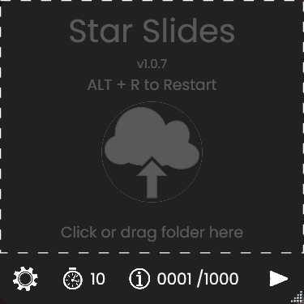

<!-- PROJECT SHIELDS -->
[![Issues][issues-shield]][issues-url]
[![MIT License][license-shield]][license-url]
[![LinkedIn][linkedin-shield]][linkedin-url]
[![Twitter][twitter-shield]][twitter-url]

<!-- PROJECT LOGO 
 

  

  <h3 align="center">Star Slides</h3>

 

<!-- TABLE OF CONTENTS -->

  
Table of Contents

  <ol>
    <li>
      <a href="#about-the-project">About The Project</a>
    </li>
    <li>
      <a href="#getting-started">Getting Started</a>
    </li>
    <li><a href="#usage">Usage</a></li>
    <li><a href="#license">License</a></li>
    <li><a href="#contact">Contact</a></li>
  </ol>

<!-- ABOUT THE PROJECT -->
## About The Project

  

Star Slides is a tool for art students, illustrators or anyone who wants to focus on improving their drawing skills.

(<a href="#top">back to top</a>)

<!-- GETTING STARTED -->
## Getting Started
  1. Download the `Setup.exe` from [here.](https://github.com/R4J4S/Star-Slides-Release/releases)
  2. Run the `Setup.exe` to install the tool.
    
  <kbd>
    
  </kbd>
  

(<a href="#top">back to top</a>)

<!-- USAGE EXAMPLES -->
## Usage
<ul>
  <li> <h3>Settings</h3>
  <li> Simple to use just drag folder that contain images into the drop area or click on the drop area to select the path to the folder.
</ul>

(<a href="#top">back to top</a>)

<!-- LICENSE -->
## License

Distributed under the MIT License. See `LICENSE` for more information.

(<a href="#top">back to top</a>)

<!-- CONTACT -->
## Contact

E-mail: r4j4sgames@gmail.com

Project Link: [https://github.com/R4J4S/Star-Slides-Release](https://github.com/R4J4S/Star-Slides-Release)

(<a href="#top">back to top</a>)

<!-- MARKDOWN LINKS & IMAGES -->
<!-- https://www.markdownguide.org/basic-syntax/#reference-style-links -->
[issues-shield]: https://img.shields.io/github/issues/R4J4S/Star-Slides-Release?label=requests&style=for-the-badge
[issues-url]: https://github.com/R4J4S/Star-Slides-Release/issues
[license-shield]: https://img.shields.io/github/license/R4J4S/Star-Slides-Release?color=MIT&style=for-the-badge
[license-url]: https://github.com/R4J4S/Star-Slides-Release/blob/main/LICENSE
[linkedin-shield]: https://img.shields.io/badge/-LinkedIn-black.svg?style=for-the-badge&logo=linkedin&colorB=555
[linkedin-url]: https://www.linkedin.com/in/r4j4s/
[twitter-shield]:https://img.shields.io/badge/-Twitter-black.svg?style=for-the-badge&logo=twitter&colorB=555
[twitter-url]:https://twitter.com/Real_Rajas
[SettingsDemo]: https://github.com/R4J4S/Star-Slides-Release/blob/main/Images/SettingsDemo.gif "SettingsDemo.gif"
[DragFileDemo]: https://github.com/R4J4S/Star-Slides-Release/blob/main/Images/DragFileDemo.gif "DragFile.gif"
